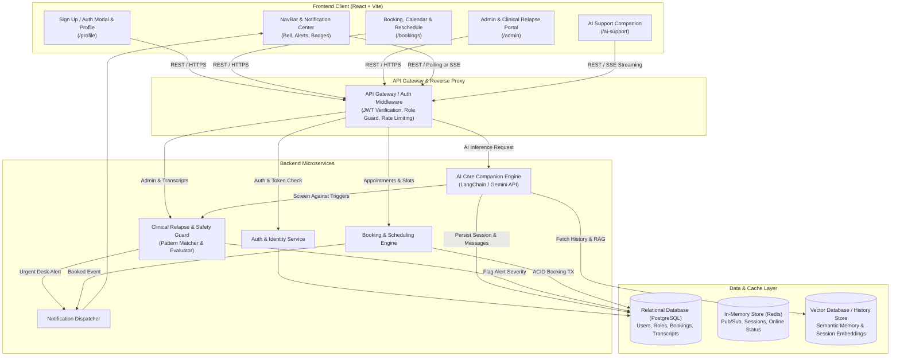
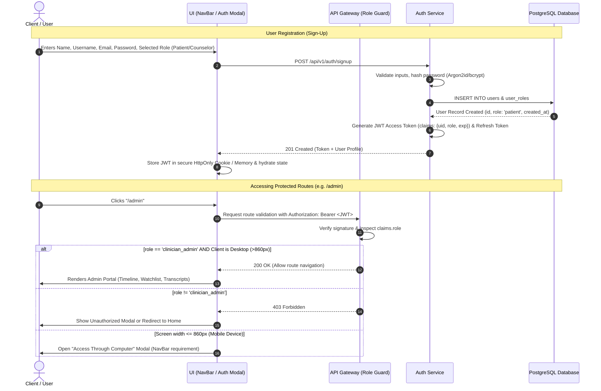
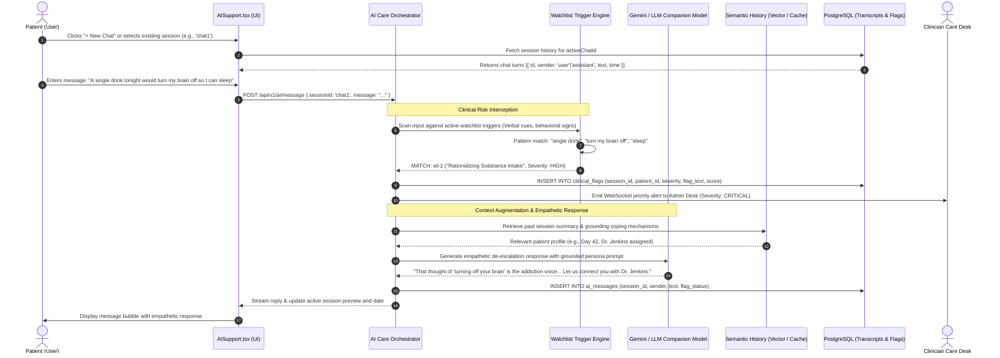
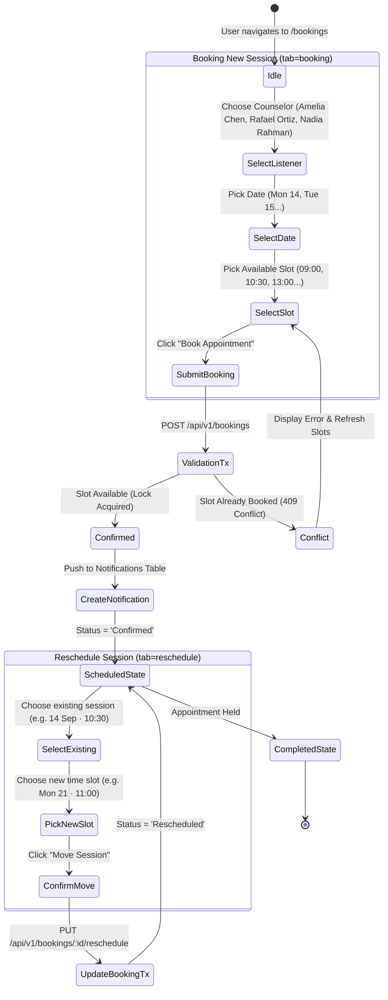
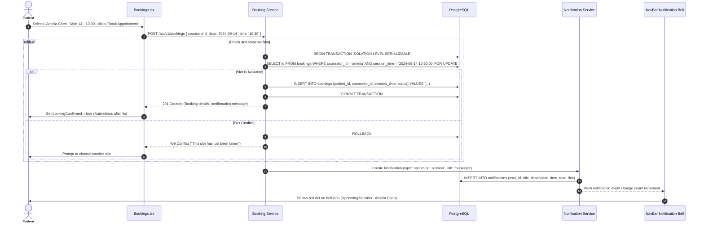
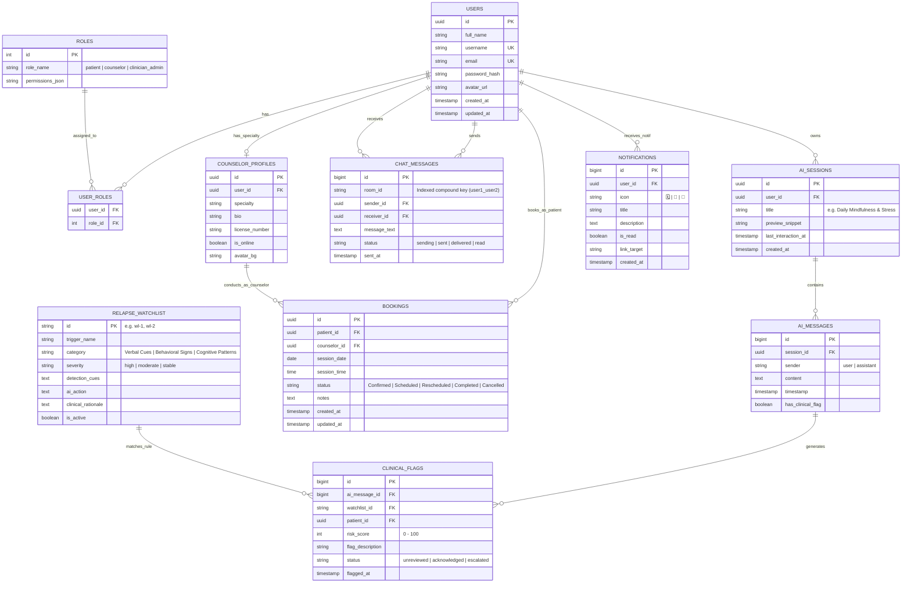

# Coherent — System Architecture, Data Flow & Storage Specifications

This document outlines the technical architecture, data flows, database schemas, and protocol specifications for all user interfaces across the **Coherent** mental health and clinical recovery platform.

---

## 1. High-Level Architecture & Component Map

The following diagram illustrates the relationship between the client-side user interfaces, API Gateway, real-time messaging services, AI pipelines, scheduling engine, and storage tiers:

---

## 2. User Sign-Up, Authentication & Role-Based Access Control (RBAC)

### 2.1 Role Permission Matrix

| Role | Accessible UI Views | Key Capabilities & Permissions |
| :--- | :--- | :--- |
| **Patient / User** | `/`, `/ai-support`, `/bookings`, `/profile` | Interacts with 24/7 AI care companion, books and reschedules appointments, manages personal profile. **Blocked from `/admin`**. |
| **Peer / Counselor** | `/`, `/bookings` (as listener), `/profile` | Manages consultation availability, scheduled appointments, and session notes. |
| **Clinical Admin** | `/admin`, `/profile` (Desktop only) | Full access to Relapse Monitoring Calendar, Upcoming Session Table, Patient Risk Scoring (0–100), AI Trigger Watchlist CRUD, and Live Flagged Transcripts. |

### 2.2 Sign-Up & Role Verification Sequence

---

## 4. AI Companion Chat & History Storage with Clinical Safeguards (`/ai-support`)

The AI Support system (`AISupport.tsx`) provides 24/7 care support across multiple isolated chat sessions (e.g., *Daily Mindfulness & Stress*, *Sleep & Relaxation Routine*). In parallel with generating empathetic responses, it evaluates client messages against active clinical relapse watchlist triggers defined in `/admin`.

### 4.1 AI Data Flow, Vector Memory & Watchlist Interception

---

## 5. Appointment Booking, Calendar & Rescheduling (`/bookings`)

The booking interface allows patients to select listeners, pick available dates and times, inspect confirmed sessions in a calendar view, and reschedule existing sessions.

### 5.1 Booking & Rescheduling State Flow

### 5.2 Slot Reservation & Notification Sequence

---

## 6. Database Entity Relationship Diagram (ERD)

This entity relationship diagram maps the storage requirements for user credentials, roles, counselor profiles, peer chat rooms, AI support sessions, bookings, and clinical relapse watchlist triggers:

